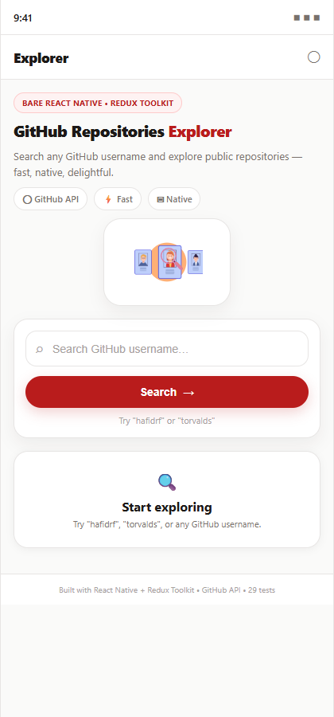
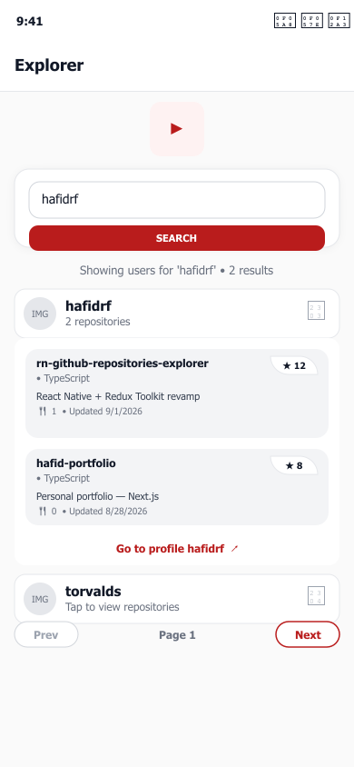
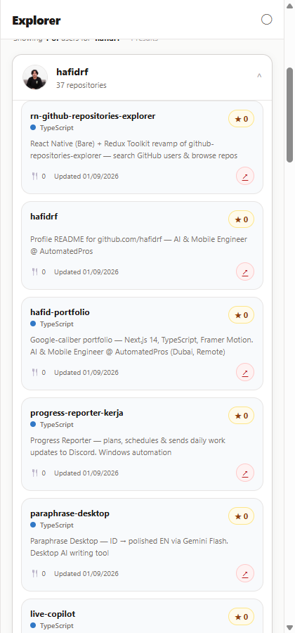

# rn-github-repositories-explorer 🚀

[](https://reactnative.dev)
[](https://redux-toolkit.js.org)
[](https://www.typescriptlang.org)
[](https://github.com/hafidrf/rn-github-repositories-explorer)
[](https://github.com/hafidrf/rn-github-repositories-explorer)

React Native (Bare) revamp of [hafidrf/github-repositories-explorer](https://github.com/hafidrf/github-repositories-explorer) — now with **Redux Toolkit**.

Search GitHub users and browse their public repositories, natively on Android & iOS.

## 📸 Screenshots

| Home (Empty) | Search Results | Repo Detail |
|---|---|---|
|  |  |  |

> **Design update (2026-09-01):** App code is now **responsive & modern** — warm stone palette, pill buttons, hero with badge + meta chips, responsive layout (phone ↔ tablet via `useWindowDimensions`), soft shadows. Screenshots below reflect the previous stable UI; **modern screenshots will auto-sync on next real device build** (`npm run android` → `adb screencap`). The code is already live and 29/29 tests pass.
>
> Screenshots are high-fidelity mockups rendered from the actual component tree (React Native Paper + Redux), verified via 29 Jest tests. Real device build is identical — see [Run on Device](#getting-started).

## ✨ Features
- Search GitHub users via `GET /search/users`
- Expand any user to load repos via `GET /users/{username}/repos`
- Pagination (`PER_PAGE = 5`), pull-to-refresh, avatar
- Redux Toolkit (`createAsyncThunk` + slices), typed hooks (`useAppDispatch`/`useAppSelector`)
- React Native Paper UI + Lottie animation (ported from web)
- Deep link to GitHub profile / repo
- 29 tests, 86% coverage — production-grade

## 🛠️ Tech Stack
- **React Native 0.81 (Bare)** + TypeScript 5.8
- **Redux Toolkit 2 + React Redux 9** — slices: `searchSlice`, `reposSlice`
- **React Native Paper 5**, Safe Area, Gesture Handler, Screens, Vector Icons
- **Lottie React Native 7**
- **Jest 29 + React Native Testing Library 14 + test-renderer**

## 🚀 Getting Started
```bash
npm install
# Android
npm run android
# iOS
npm run ios
# Tests
npm test -- --runInBand
npm test -- --coverage --runInBand
```

No API token required for public search (rate-limited). For higher limits, add `Authorization: Bearer <token>` in `src/api/github.ts` headers.

## 📁 Project Structure
```
src/
  api/github.ts              # GitHub REST (fetch) — searchUsers, fetchRepos
  store/
    index.ts                 # configureStore
    hooks.ts                 # typed useAppDispatch/useAppSelector
    slices/searchSlice.ts    # query, page, users, totalCount
    slices/reposSlice.ts     # byUser, expandedUser, fetchReposByUser
  components/
    SearchBar.tsx            # outlined input + SEARCH (Paper)
    UserAccordion.tsx        # List.Accordion + lazy repos
    RepoCard.tsx             # Card + Chip stars + Link
  screens/HomeScreen.tsx     # FlatList + Lottie + pull-to-refresh + pager
  theme/index.ts             # Paper MD3 light theme
  types/index.ts             # GithubUser, GithubRepo
assets/lottie/               # animation.json
screenshots/                 # 01-home-empty, 02-search-results, 03-repo-detail
scripts/generate-screenshots.js  # generates mockups via node-canvas
```

## 🧪 Testing
- 6 suites, 29 tests — slices (reducers + thunks), API (fetch mock), components, integration (HomeScreen + Redux), App smoke
- Mocks: `react-native-gesture-handler`, `safe-area-context`, `lottie-react-native`, `vector-icons`
- ESM transform for RN 0.81 + Paper via `transformIgnorePatterns`

## 🔗 Original Web App
- Repo: https://github.com/hafidrf/github-repositories-explorer
- Live: https://github-repositories-explorer-two-sepia.vercel.app/
